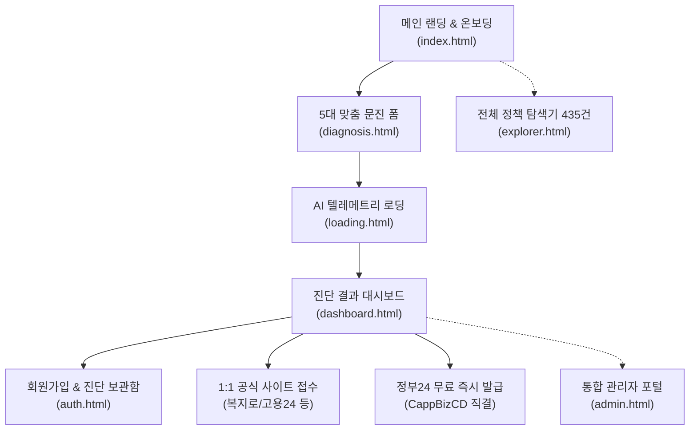
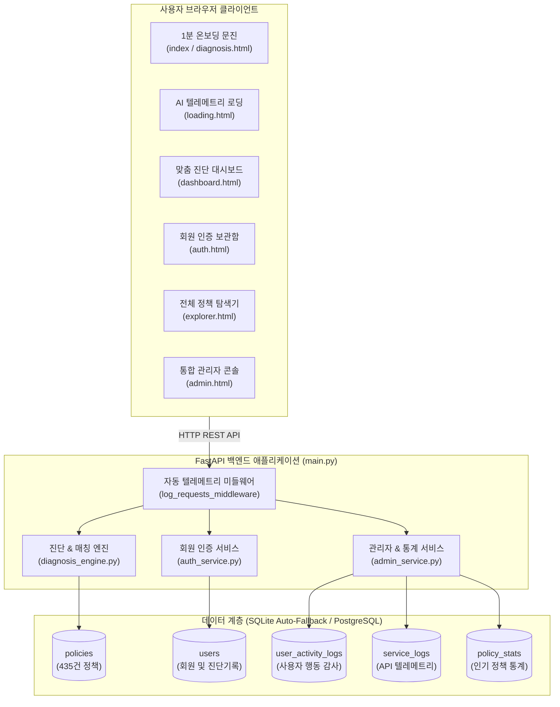

# 🏛️ 유스핏 AI (YouthFit AI)
> **"서류 읽느라 놓친 청년 지원금, 1분 진단으로 찾아주는 AI 복지 비서"**  
> *Production-Ready Civic Tech Intelligence & Real-Time Admin Monitoring Platform*

[](LICENSE)
[](https://www.python.org/)
[](https://fastapi.tiangolo.com/)
[%20%2F%20PostgreSQL-4169E1.svg?logo=sqlite&logoColor=white)](#-시스템-아키텍처--데이터베이스-설계)
[](https://www.youthcenter.go.kr)
[](#-듀얼-디자인-시스템-uiux-명세-dark--light)
[](#-통합-관리자-포털-admin-portal-상세-명세)
[](#-최근-주요-오류-수정-및-고도화-내역-notion-이슈-대응)

---

## 📌 목차
1. [프로젝트 개요](#-프로젝트-개요)
2. [핵심 문제의식 및 솔루션](#-핵심-문제의식-및-솔루션)
3. [최근 주요 오류 수정 및 고도화 내역 (Notion 이슈 대응)](#-최근-주요-오류-수정-및-고도화-내역-notion-이슈-대응)
4. [주요 서비스 화면 & 사용자 플로우](#-주요-서비스-화면--사용자-플로우)
   - [1. 1분 온보딩 문진 (`index.html`, `diagnosis.html`)](#1-1분-온보딩-문진-indexhtml-diagnosishtml)
   - [2. AI 매칭 분석 콘솔 (`loading.html`)](#2-ai-매칭-분석-콘솔-loadinghtml)
   - [3. 맞춤 진단 결과 대시보드 (`dashboard.html`)](#3-맞춤-진단-결과-대시보드-dashboardhtml)
   - [4. 회원 인증 및 진단 이력 보관함 (`auth.html`)](#4-회원-인증-및-진단-이력-보관함-authhtml)
   - [5. 전체 정책 탐색기 (`explorer.html`)](#5-전체-정책-탐색기-explorerhtml)
   - [6. 통합 관리자 모니터링 포털 (`admin.html`)](#6-통합-관리자-모니터링-포털-adminhtml)
5. [통합 관리자 포털 (Admin Portal) 상세 명세](#-통합-관리자-포털-admin-portal-상세-명세)
6. [공식 사이트 신청 & 정부24 서류 발급 1:1 직결 체계](#-공식-사이트-신청--정부24-서류-발급-11-직결-체계)
7. [듀얼 디자인 시스템 UI/UX 명세 (Dark & Light)](#-듀얼-디자인-시스템-uiux-명세-dark--light)
8. [시스템 아키텍처 & 데이터베이스 설계](#-시스템-아키텍처--데이터베이스-설계)
9. [전체 프로젝트 폴더 및 파일 구조 상세 안내](#-전체-프로젝트-폴더-및-파일-구조-상세-안내)
10. [REST API 엔드포인트 규격서](#-rest-api-엔드포인트-규격서)
11. [시작 가이드 (Quick Start)](#-시작-가이드-quick-start)
12. [데모 시나리오 (페르소나 2종)](#-데모-시나리오-페르소나-2종)
13. [자동화 테스트 및 기능 검증](#-자동화-테스트-및-기능-검증)

---

## 💡 프로젝트 개요

수십 페이지에 달하는 난해하고 파편화된 정부·지자체 청년 정책 공고문! 신청 자격이 되는지, 어떤 서류를 준비해야 하는지 몰라 청년들이 수백만 원 상당의 혜택을 놓치고 있습니다.

**유스핏 AI(YouthFit AI)**는 청년의 핵심 조건(만 나이, 거주 지역구, 고용 상태, 가구 형태, 기준 중위소득)을 바탕으로 **1분 맞춤 진단**을 수행하여:
- 정부 **'온통청년' 전국 공공데이터 Open API (423건+)**와 **서울시/지자체 핵심 정책 DB** 교차 검증
- **2026년 기준 실시간 유효성 검증 엔진** 및 **동적 D-Day/마감일 정밀 산출**
- 단순 메인 홈 링크가 아닌 **실제 온라인 신청/접수 페이지로의 1:1 직결**
- 제출 서류별 **정부24(`CappBizCD`), 대법원 전자가족관계등록시스템 고유 발급 페이지 1:1 맞춤 연동**
- **실시간 사용자 활동 로그, 웹 서비스 작동 텔레메트리(지연시간, 상태코드), 인기 정책 통계를 관제하는 통합 관리자 포털(Admin Portal)**까지 완비된 차세대 지능형 복지 비서 플랫폼입니다.

---

## 🎯 핵심 문제의식 및 솔루션

| 기존 청년 정책 탐색의 페인포인트 | 유스핏 AI (YouthFit AI)의 솔루션 |
| :--- | :--- |
| **정보의 파편화**: 복지로, 고용24, 온통청년, 서울청년몽땅정보통 등 수십 개 사이트에 분산 | **원스톱 통합 파이프라인**: 435건의 전국 및 지자체 핵심 청년 정책 DB 통합 적재 및 초고속 검색 |
| **복잡한 자격 요건**: 기준 중위소득, 단서 조항, 예외 규정 등 20~30페이지 공고문 | **지능형 다단계 판별 엔진**: 룰 기반 필터링 + 적합도 점수(55~99%) 산정 및 AI 판별 사유 리포트 제공 |
| **만료되거나 왜곡된 마감 기한**: 상시 신청 정책인데 마감 임박으로 잘못 안내되거나 지난 연도 표기 | **동적 D-Day 계산 엔진**: '연중 상시 신청 가능' 정확 판별 및 실제 종료일 기준 `D-Day 오늘 마감!`, `D-N 마감 임박` 실시간 산출 |
| **엉뚱한 홈페이지 메인 연결**: 신청 버튼을 누르면 포털 메인으로 튕겨 재검색 필요 | **1:1 정책 상세/접수 직결 링크**: 복지로/고용24 메인이 아닌 해당 정책의 실제 온라인 접수 폼으로 직접 이동 |
| **서류 발급처 미아 현상**: 서류 이름만 나열되어 어디서 발급받는지 모름 | **정부24 및 공공기관 서류 1:1 매핑**: 초본, 졸업증명서, 고용보험이력서 등 각 민원 고유 신청 화면으로 바로 연결 |
| **운영 현황 및 이용 분석 부재**: 어떤 정책을 많이 찾고 서비스가 어떻게 동작하는지 관제 불가 | **통합 관리자 콘솔 (Admin Portal)**: 4대 KPI, 인기 정책 순위, 사용자 활동 로그, API 작동 텔레메트리 완비 |

---

## 🛠️ 최근 주요 오류 수정 및 고도화 내역 (Notion 이슈 대응)

사용자 피드백 및 오류사항 문서(Notion 이슈 및 첨부 이미지 5종)를 철저히 분석하여 프로젝트 전반의 UI/UX와 백엔드 로직을 전면 개편하였습니다:

```
┌─────────────────────────────────────────────────────────────────────────────────────────────┐
│                             YouthFit AI 고도화 및 이슈 해결 요약                             │
├───────────────────┬─────────────────────────────────────────────────────────────────────────┤
│ [1] UI 오버레이    │ • dashboard.html 좌측 사이드바 하단 '진단 적합도 점수' 카드가 떠 있는  │
│     간섭 해소     │   테마 전환 버튼에 가려지는 문제 완벽 해결                               │
│     (image 8.png) │ • 플로팅 버튼 제거 후 사이드바 내부 인라인 네비게이션으로 깔끔하게 통합   │
├───────────────────┼─────────────────────────────────────────────────────────────────────────┤
│ [2] 정책 모집 기간 │ • 2024년 등 과거 마감 공고로 안내되던 핵심 정책 12종 2026년 최신 유효  │
│     2026년 현실화 │   일정으로 전면 갱신 (seed_core_policies.py)                            │
│     (image 9.png) │ • 날짜 유효성 검증 엔진(check_policy_date_validity) 탑재로 기한 지난     │
│                   │   공고 사전 필터링 및 DB 재시딩 완료                                    │
├───────────────────┼─────────────────────────────────────────────────────────────────────────┤
│ [3] 동적 D-Day     │ • 연중 상시 신청 가능 정책에 하드코딩된 'D-5 마감 임박'이 노출되던 결함 │
│     정밀 연산     │   제거 및 실제 날짜 파싱 기반 동적 계산 엔진 구현                        │
│     (image 10.png)│ • '연중 상시 신청 가능' / 'D-Day 오늘 마감!' / 'D-N 마감 임박' 구분 표시 │
├───────────────────┼─────────────────────────────────────────────────────────────────────────┤
│ [4] 관리자 포털   │ • 사용자 활동 로그, 웹 서비스 작동 텔레메트리, 인기 정책 통계를 실시간  │
│     신규 구축     │   관제하는 통합 관리자 대시보드(admin.html / services/admin_service.py) │
│                   │ • FastAPI 미들웨어로 모든 API 요청 지연시간(ms), 상태코드 자동 수집     │
├───────────────────┼─────────────────────────────────────────────────────────────────────────┤
│ [5] 1:1 직결      │ • 정책 신청: 포털 메인이 아닌 '실제 접수/상세 안내 페이지'로 1:1 직결    │
│     링크 고도화   │ • 서류 발급: 정부24 메인이 아닌 해당 민원 고유코드(CappBizCD) 및         │
│ (image 11, 12.png)│   법원 시스템 1:1 발급 화면 연동 및 안내 라벨 차별화                     │
├───────────────────┼─────────────────────────────────────────────────────────────────────────┤
│ [6] 관리자 권한   │ • users 테이블 role('admin'/'user') 및 Depends(require_admin) RBAC 탑재  │
│     (RBAC) & 직행 │ • 'admin' 단축 로그인 시 dashboard.html 경유 없이 admin.html 즉시 직행   │
│                   │ • 비인가 사용자 admin.html 직접 URL 접근 시 클라이언트+백엔드 즉시 차단 │
│                   │ • admin.html에 실제 DB users 연동 [회원 계정 관리] 탭 신규 구축         │
├───────────────────┼─────────────────────────────────────────────────────────────────────────┤
│ [7] Google OAuth  │ • Google Cloud 공식 Client ID 발급 및 .env 실시간 연동 완료              │
│     2.0 정식 연동 │ • GIS Token Client 팝업으로 실제 구글 프로필 수신 및 DB 자동 가입       │
├───────────────────┼─────────────────────────────────────────────────────────────────────────┤
│ [8] 세션 생명주기 │ • 첫 랜딩 시 이전 잔여 세션 자동 정화(purge)로 깔끔한 로그아웃 상태 유지 │
│     (Lifecycle)   │ • 로그인 후 새로고침(F5) 및 페이지 이동 시 sessionStorage로 로그인 유지 │
│                   │ • "로그인 상태 유지" 체크 시 localStorage 7일 만료 기한 연동             │
│                   │ • 브라우저 창/탭 닫으면 기본 세션 자동 소멸로 안전한 재방문 환경 보장   │
└───────────────────┴─────────────────────────────────────────────────────────────────────────┘
```

---

## 🚀 주요 서비스 화면 & 사용자 플로우



### 1. 1분 온보딩 문진 (`index.html`, `diagnosis.html`)
- **실시간 프로그레스 추적**: 만 나이(19~39세), 거주 지역(전국 17개 시도 및 서울 25개 자치구), 취업상태, 가구형태, 소득분위 5대 핵심 질문.
- **원클릭 페르소나 프리셋**: 관악구 24세 알바 취준생 / 마포구 28세 중소기업 재직자 원클릭 즉시 자동 입력 지원.
- **주요 정책 12선 퀵 프리뷰**: 서울시 청년수당, 청년월세지원, 국민취업지원제도 등 대표 혜택 실시간 미리보기.

### 2. AI 매칭 분석 콘솔 (`loading.html`)
- **3단계 매칭 텔레메트리**: 
  1. `[완료]` 1차 자격 필터링 (연령, 시도·시군구 거주지, 고용상태 교차 검증)
  2. `[연산 중]` AI 적격도 정밀 분석 및 자격 알고리즘 매칭
  3. `[완료]` 수혜 금액 합산 및 1:1 맞춤 서류 패키징
- **부드러운 SVG 프로그레스 애니메이션**: 백엔드 API 완료 시 100% 도달 후 자동 대시보드 전환.

### 3. 맞춤 진단 결과 대시보드 (`dashboard.html`)
- **2026 예상 수혜액 히어로 배너**: 올해 수혜 가능한 총 예상 혜택 금액(예: `₩3,200,000`) 시각화.
- **동적 마감 임박 알림**: 실제 마감 7일 이내 정책 건수(`0건 (여유)` 또는 `N건`) 실시간 반영.
- **진단 적합도 점수 카드 UI 최적화**: 좌측 사이드바 하단에 독립 배치되어 어떠한 오버레이에도 가려지지 않고 선명하게 노출.
- **맞춤 정책 카드**:
  - `적격 1~4순위` 뱃지 및 적합도 퍼센트 (`99%`, `95%` 등)
  - **정밀 D-Day 뱃지**: `연중 상시 신청 가능`, `D-Day 오늘 마감!`, `D-N 마감 임박`, `D-N 접수 중`
  - **YouthFit AI 자격 판별 알고리즘 리포트**: 자격 선정 이유 3대 체크포인트 노출
  - **공고문 AI 요약본 모달**: 핵심 지원 내용, 소관 부처, 신청 기간, 제출 서류 일괄 안내
  - **신청 바로가기**: 해당 정책 고유 신청 페이지로 1:1 직결 및 클릭 통계 추적
- **인터랙티브 서류 체크리스트**:
  - 정부24 고유 서비스 페이지(`CappBizCD`) 및 공공기관 1:1 직결 링크 제공
  - 체크 시 실시간 서류 준비율(%) 프로그레스 서클 연동

### 4. 회원 인증 및 진단 이력 보관함 (`auth.html`)
- **이메일/비밀번호 간편 가입 및 로그인** (PBKDF2-HMAC-SHA256 암호화 보안).
- **Google OAuth 2.0 공식 클라우드 연동**: Google Cloud 콘솔 공식 Client ID 기반 Token Client 팝업 연동 및 DB 자동 계정 생성.
- **세션 생명주기(Session Lifecycle) 아키텍처**:
  - **첫 접속/랜딩**: 잔여 레거시 데이터 자동 정화(`purgeLegacyAuthResidue`)로 언제나 깨끗한 **로그아웃 상태(게스트)** 로 시작.
  - **새로고침(F5) 유지**: 로그인 성공 시 세션은 `sessionStorage`에 보관되어 새로고침하거나 페이지를 이동해도 풀리지 않음.
  - **로그인 상태 유지**: `이 기기에서 로그인 상태 유지` 체크 시 `localStorage` 7일 만료 기한 연동.
  - **창 종료 시 보안 파기**: 체크하지 않은 일반 세션은 브라우저 창/탭을 닫는 즉시 자동 소멸.
- **역할 기반 즉시 직행 라우팅**:
  - 관리자 계정(`admin` / `admin1234!`) 로그인 시 -> 딜레이 없이 🛡️ **`admin.html` (통합 관리자 포털)** 로 즉시 직행.
  - 일반 회원 계정 로그인 시 -> 👤 **`dashboard.html` (사용자 맞춤 대시보드)** 로 이동.
- **진단 결과 영구 저장 및 재조회**: 로그인 시 과거 진단 결과 및 추천 서류 패키지 보관함 자동 연동.

### 5. 전체 정책 탐색기 (`explorer.html`)
- 적재된 **전체 435건(온통청년 423건 + 서울시/전국 핵심 12건)** 정책 실시간 검색 및 필터링.
- 대분류(일자리, 주거, 금융·복지·문화, 교육·직업훈련), 지역, 연령별 실시간 다이나믹 필터링.

### 6. 통합 관리자 모니터링 포털 (`admin.html`)
- 서비스 운영 현황을 실시간으로 감시하는 통합 관제 대시보드 (`/admin`, `/admin.html`).
- **RBAC 보안 가드**: 백엔드 `Depends(require_admin)` 및 프론트엔드 `guardAdminPage()`로 비인가 사용자 즉시 차단(401/403).
- 4대 KPI 지표 카드, 4개 인터랙티브 탭(인기 정책, 활동 로그, 텔레메트리, **DB 회원 관리**), 5초 자동 갱신 지원.

---

## 🛡️ 통합 관리자 포털 (Admin Portal) 상세 명세

운영자와 관리자가 서비스의 가동 상태와 청년들의 복지 수요를 실시간으로 파악할 수 있는 전용 관리자 포털입니다.

```
┌────────────────────────────────────────────────────────────────────────┐
│                        YouthFit Admin Portal                           │
│  [● 시스템 정상 가동 중]  [실시간 자동 갱신: 5초]  [다크/라이트 테마 전환] │
├────────────────────────────────────────────────────────────────────────┤
│  [ KPI 1 ] 총 진단 실행 건수  │  [ KPI 2 ] 누적 회원 및 활성 청년     │
│  [ KPI 3 ] API 작동 처리 수   │  [ KPI 4 ] 최다 매칭 인기 정책 TOP 1 │
├────────────────────────────────────────────────────────────────────────┤
│  [Tab 1] 많이 찾는 정책 데이터 분석                                   │
│   • 정책별 순위 (#1, #2...), 소관분야, 진단 매칭수, 신청 클릭수, 점수  │
│   • 실시간 검색 및 직결 링크 검증 기능                                │
│                                                                        │
│  [Tab 2] 사용자 활동 로그                                             │
│   • 타임스탬프, 사용자(회원/게스트), 활동 유형(진단, 로그인, 신청 이동) │
│   • 진단 조건(나이, 지역, 직업, 소득), Client IP 기록                  │
│                                                                        │
│  [Tab 3] 웹 서비스 작동 로그 (API 텔레메트리)                          │
│   • HTTP Method(GET/POST), Endpoint Path, Status Code(200/400/500)    │
│   • 레이턴시(duration_ms), Client IP 실시간 텔레메트리                 │
│                                                                        │
│  [Tab 4] 회원 계정 관리 (DB users)                                    │
│   • 실제 DB users 테이블 실시간 동기화 (총 회원수, ID, 이메일, 이름, 역할) │
│   • 가입 일시, 최근 로그인 시간 모니터링 및 실시간 검색/필터링         │
└────────────────────────────────────────────────────────────────────────┘
```

### 1. 4대 실시간 KPI 지표
- **총 진단 실행 건수**: 청년 사용자들이 온보딩 및 맞춤 진단을 실행한 총 횟수.
- **누적 회원 및 활성 청년**: 실제 `users` DB 테이블에 등록된 계정 수 및 최근 24시간 이내 서비스 활동 인원.
- **웹 서비스 API 처리 수**: 백엔드가 응답한 총 API 요청 수 및 평균 지연 시간 (Latency, ms).
- **최다 매칭 인기 정책 TOP 1**: 청년들에게 가장 많은 혜택으로 진단·추천된 대표 정책.

### 2. 4대 분석 및 감사 탭
- **많이 찾는 정책 데이터 분석**: 정책별 진단 매칭 횟수, 공고문 상세 조회 수, 공식 사이트 신청 클릭 수, 종합 관심도 지수.
- **사용자 활동 로그 (Audit Trail)**: 진단 실행, 회원가입/로그인, 정책 상세 조회, 외부 신청 링크 이동 등 유저 행동 실시간 기록.
- **웹 서비스 작동 로그 (API Telemetry)**: FastAPI 미들웨어가 캡처한 HTTP Method, Path, Status Code, Duration(ms), Client IP.
- **회원 계정 관리 (DB users)**: 실제 데이터베이스에 가입된 회원들의 목록(이메일, 이름, 권한 역할, 가입일, 최근 로그인 일시)을 실시간 조회/검색.

---

## 🔗 공식 사이트 신청 & 정부24 서류 발급 1:1 직결 체계

### 1. 주요 정책별 1:1 신청 직결 URL
단순 포털 메인이 아닌, **실제 정책 안내 및 온라인 신청 페이지**로 직접 연결됩니다:

| 정책명 | 소관 부처 / 지자체 | 1:1 직결 신청 페이지 URL |
| :--- | :--- | :--- |
| **서울시 청년수당** | 서울특별시 | [서울청년몽땅정보통 청년수당 접수](https://youth.seoul.go.kr/youthConts.do?key=200) |
| **국민취업지원제도 (1유형)** | 고용노동부 | [고용24 국민취업지원제도 온라인 신청](https://www.work24.go.kr/cm/c/a/0110/selectEmpSptPlcyDtl.do) |
| **청년 부동산 월세 특별지원** | 국토교통부 | [복지로 청년월세 특별지원 신청](https://www.bokjiro.go.kr/ssis-tbu/twataa/wlfareInfo/moveTWAT52011M.do?wlfareInfoId=WLF00004661) |
| **청년 대중교통비 지원사업** | 서울특별시 | [서울청년몽땅정보통 교통비 지원](https://youth.seoul.go.kr/youthConts.do?key=2024102900001) |
| **희망두배 청년통장** | 서울특별시 | [서울시 희망두배청년통장 사업안내](https://account.welfare.seoul.kr/) |
| **청년 임차보증금 대출이자 지원**| 서울시 주택실 | [서울주거포털 청년임차보증금 신청](https://housing.seoul.go.kr/site/main/content/sh01_060500) |
| **서울시 취업날개 면접정장 무료 대여** | 서울특별시 | [서울일자리포털 취업날개 지점 예약](https://job.seoul.go.kr/www/jobWing/jobWingIntro.do) |
| **청년 국가자격증 응시료 지원** | 서울특별시 | [서울청년몽땅정보통 응시료 환급신청](https://youth.seoul.go.kr/youthConts.do?key=2024102900003) |
| **청년 마음건강 심리상담 바우처** | 서울특별시 | [서울청년몽땅정보통 마음건강 접수](https://youth.seoul.go.kr/youthConts.do?key=2024102900004) |
| **청년도약계좌** | 금융위원회 / 서민금융진흥원 | [서민금융진흥원 청년도약계좌 가입안내](https://ylaccount.kinfa.or.kr/main) |
| **K-패스 청년 환급** | 국토교통부 대도시권광역교통위원회 | [K-패스 공식 사이트 카드등록 및 환급](https://korea-pass.kr/info/info_intro.do) |
| **온통청년 연계 정책 (423건)** | 중앙부처 및 전국 지자체 | `https://www.youthcenter.go.kr/youngPlcyUnif/youngPlcyUnifDtl.do?bizId={policy_id}` |

### 2. 증빙서류별 1:1 전용 발급처 매핑

| 필요 서류명 | 고유 서비스 / 인증 기관 | 직결 발급처 링크 (CappBizCD) |
| :--- | :--- | :--- |
| **주민등록표초본 / 등본** | 정부24 주민등록표등본(초본) 교부 | [정부24 바로 발급 (CappBizCD=13100000015)](https://www.gov.kr/mw/AA020InfoCappView.do?CappBizCD=13100000015) |
| **최종학력 졸업증명서** | 정부24 대학(교) 졸업(예정)증명 | [정부24 바로 발급 (CappBizCD=13404000001)](https://www.gov.kr/mw/AA020InfoCappView.do?CappBizCD=13404000001) |
| **고용보험 피보험자격 이력내역서** | 정부24 고용보험 피보험자격 이력내역서 | [정부24 바로 발급 (CappBizCD=14900000065)](https://www.gov.kr/mw/AA020InfoCappView.do?CappBizCD=14900000065) |
| **소득금액증명원** | 정부24 소득금액증명 발급 | [정부24 바로 발급 (CappBizCD=12100000021)](https://www.gov.kr/mw/AA020InfoCappView.do?CappBizCD=12100000021) |
| **건강보험자격득실확인서** | 정부24 건강보험 자격득실확인서 | [정부24 바로 발급 (CappBizCD=14700000040)](https://www.gov.kr/mw/AA020InfoCappView.do?CappBizCD=14700000040) |
| **가족관계증명서** | 대한민국 법원 전자가족관계등록시스템 | [법원 전자가족관계등록 발급 시스템](https://efamily.scourt.go.kr/pt/PtFrnList.do) |
| **표준근로계약서 양식** | 고용노동부 공식 서식자료실 | [고용노동부 표준서식 다운로드](https://www.moel.go.kr/info/defaulForm/defaultFormList.do) |

---

## 🎨 듀얼 디자인 시스템 UI/UX 명세 (Dark & Light)

| 디자인 속성 | 🌙 다크 모드 (`Kinetic Glass AI`) | ☀️ 라이트 모드 (`Fintech Civic`) |
| :--- | :--- | :--- |
| **핵심 무드** | 미래지향적 AI 랩, 정밀 텔레메트리 인터페이스 | 토스·카카오뱅크 수준의 명쾌함과 재정적 신뢰감 |
| **캔버스 배경** | `#0b1120` / `#0b1326` (딥 스페이스 네이비) | `#F8FAFC` (소프트 슬레이트 페이퍼) |
| **카드 표면** | `rgba(15, 23, 42, 0.65)` (블러 글래스모피즘) | `#FFFFFF` (퓨어 솔리드 화이트) |
| **프라이머리 컬러**| `#06b6d4` (Cyber Cyan) | `#2563EB` (Electric Blue) |
| **수혜액 하이라이트**| `#45dfa4` (Kinetic Emerald Glow) | `#059669` (Fintech Emerald Green) |
| **테두리 경계선** | `1px solid rgba(255, 255, 255, 0.08)` | `1px solid #E2E8F0` (Hairline Border) |
| **깊이감 표현** | Backdrop Blur (16~24px) + Photon Glow | 정밀 1px 헤어라인 보더 + 앰비언트 디퓨전 |
| **타이포그래피** | Plus Jakarta Sans + Inter + JetBrains Mono | Plus Jakarta Sans + Pretendard (Tabular Nums) |
| **상태 관리** | `localStorage('youthfit_theme')` 실시간 동기화 | 모든 페이지 상단 헤더 및 사이드바 테마 버튼 지원 |

---

## ⚙️ 시스템 아키텍처 & 데이터베이스 설계



### 데이터베이스 테이블 스키마 개요
1. **`policies`**: 온통청년 OpenAPI(423건) 및 전국/서울시 핵심 12종 정책의 상세 자격 조건, 지원 금액, 2026 유효 신청 기간, 1:1 직결 URL 적재.
2. **`users`**: 가입 회원 계정 정보(Salted PBKDF2 해시 비밀번호), 최근 문진 조건, 최근 진단 매칭 결과 JSON 보관.
3. **`user_activity_logs`**: 진단 실행, 정책 상세 모달 열람, 외부 공식 신청처 이동 등 사용자 액션 실시간 감사 로그.
4. **`service_logs`**: 모든 HTTP 요청의 Method, Path, Status Code, 지연시간(Duration ms), Client IP 등 텔레메트리 기록.
5. **`policy_stats`**: 정책별 진단 매칭 수(matched_count), 상세 조회 수(view_count), 공식 신청 클릭 수(apply_click_count) 통계.

---

## 📁 전체 프로젝트 폴더 및 파일 구조 상세 안내

```bash
YouthFit/
├── README.md                      # [문서] 프로젝트 종합 공식 기술 가이드 (본 문서)
├── requirements.txt               # [의존성] FastAPI, Uvicorn, Requests, BeautifulSoup4 등 패키지 목록
├── main.py                        # [백엔드] FastAPI 애플리케이션 엔트리포인트, 미들웨어 및 REST API 라우터
├── pyproject.toml                 # [설정] 프로젝트 패키징 메타데이터
├── Dockerfile                     # [인프라] 컨테이너 배포용 도커 파일
├── Procfile                       # [인프라] 클라우드 PaaS 배포용 프로세스 파일
├── .env                           # [환경변수] API 키, DB 연결 문자열 등 보안 설정
│
├── services/                      # [비즈니스 로직 계층]
│   ├── __init__.py                # 서비스 패키지 식별자
│   ├── diagnosis_engine.py        # 5대 조건 룰 매칭, 2026 기간 유효성 검증, 동적 D-Day, 정부24 서류 직결 엔진
│   ├── auth_service.py            # PBKDF2 암호화 해싱, 회원가입/로그인, Google Auth, 진단 이력 영구 보관
│   └── admin_service.py           # [NEW] 관리자 통계, 사용자 감사 로그, 웹 서비스 텔레메트리 수집 서비스
│
├── web/                           # [프론트엔드 웹 계층]
│   ├── index.html                 # 서비스 소개 랜딩 페이지 & 퀵 온보딩 12선 프리뷰
│   ├── diagnosis.html             # 5단계 정밀 맞춤 문진 폼 (페르소나 원클릭 프리셋 지원)
│   ├── loading.html               # 실시간 AI 3단계 매칭 분석 텔레메트리 로딩 콘솔
│   ├── dashboard.html             # 맞춤 진단 결과 대시보드 (수혜액 카운터, 동적 D-Day, 서류 체크리스트)
│   ├── auth.html                  # 회원 인증, 소셜 로그인 및 지난 진단 이력 보관함
│   ├── explorer.html              # 전국 435건 전체 청년 정책 실시간 검색 및 다이나믹 필터링
│   ├── admin.html                 # [NEW] 실시간 관제 통합 관리자 콘솔 (Admin Portal)
│   │
│   ├── css/
│   │   └── style.css              # Kinetic Glass (Dark) & Fintech Civic (Light) 통합 디자인 토큰
│   │
│   ├── js/
│   │   ├── app.js                 # 전역 공통 유틸리티, 다크/라이트 테마 동기화, 사용자 세션 관리
│   │   ├── survey.js              # 문진 단계별 입력 검증, 슬라이더 동기화, 페르소나 자동 완성
│   │   ├── loading.js             # SVG 원형 프로그레스 애니메이션, 백엔드 API 연동
│   │   ├── dashboard.js           # 동적 D-Day 계산, 정책 카드 렌더링, 정부24 서류 체크, 클릭 텔레메트리
│   │   └── auth.js                # 회원가입, 로그인, Google Auth 핸들러 및 보관함 연동
│   │
│   ├── assets/                    # 아이콘 및 정적 그래픽 에셋
│   └── YouthFit-Logo/             # 서비스 공식 고해상도 로고 및 파비콘 에셋
│
├── data/                          # [데이터 계층]
│   ├── youthfit.db                # SQLite 데이터베이스 (정책 435건, 유저, 로그, 통계 통합)
│   ├── youth_policies_19_34.json  # 온통청년 Open API 기반 만 19~34세 전국 정책 데이터셋 (423건)
│   ├── policies_explorer.html     # 정적 정책 뷰어 리포트
│   └── raw_sample.json            # 원천 공공데이터 샘플 JSON
│
└── scripts/                       # [데이터 수집, DB 관리, 테스트 도구]
    ├── db_connection.py           # SQLite 자동 폴백 & PostgreSQL 하이브리드 커넥터 및 DDL 초기화
    ├── seed_core_policies.py      # 2026년 유효 일정 기준 핵심 12종 정책 + 온통청년 423건 DB 시딩
    ├── sync_policies_db.py        # 온통청년 Open API 실시간 수집 및 데이터베이스 동기화
    ├── sync_policies_scheduler.py # 주기적 정책 업데이트 스케줄러
    ├── generate_explorer.py       # 정책 탐색용 정적 HTML 생성기
    ├── init_users_table.py        # 회원 인증 테이블 초기화
    ├── init_postgres.sql          # PostgreSQL DDL 스크립트
    ├── migrate_sqlite_to_pg.py    # SQLite 데이터를 PostgreSQL로 마이그레이션
    ├── view_db.py                 # 터미널 기반 데이터베이스 조회 도구
    ├── test_auth_api.py           # 인증 REST API 엔드포인트 테스트
    ├── test_auth_service.py       # 암호화 및 유저 서비스 단위 테스트
    ├── test_nationwide_api.py     # 전국 17개 시도 매칭 API 테스트
    ├── test_personas.py           # 알바 취준생 & 중소기업 재직자 시나리오 검증
    ├── test_youthfit_fixes.py     # [NEW] 대시보드, 관리자 포털, 2026 유효성, 텔레메트리 7종 통합 검증
    ├── verify_flow.py             # 온보딩 -> 로딩 -> 대시보드 전체 플로우 검증
    └── crawlers/                  # 지자체 및 공공 포털 맞춤 크롤러 모듈
        ├── base_crawler.py        # 크롤러 베이스 클래스 (재시도, 헤더, 예외 처리)
        ├── bs4_crawler.py         # BeautifulSoup4 기반 정적 HTML 스크래퍼
        ├── hidden_api_crawler.py  # 비공개 XHR/JSON 엔드포인트 역공학 크롤러
        ├── nationwide_crawler.py  # 전국 지자체 청년 정책 게시판 크롤러
        └── playwright_crawler.py  # Playwright 기반 헤드리스 브라우저 크롤러
```

---

## 📡 REST API 엔드포인트 규격서

### 1. 진단 및 정책 API
- `POST /api/diagnose`: 5대 조건 문진 데이터 기반 AI 맞춤 정책 진단 실행 (활동 로그 및 매칭 통계 자동 기록)
- `GET /api/policies/top12`: 메인 화면용 2026 대표 핵심 청년 정책 12선 조회
- `GET /api/policies`: 전체 정책 목록 조회 (키워드, 분야, 지역, 정렬, 페이징 지원)
- `GET /api/policies/{policy_id}`: 단일 정책 상세 공고문 정보 조회

### 2. 회원 인증 및 보관함 API
- `POST /api/auth/signup`: 이메일/비밀번호 신규 회원가입 (PBKDF2 해싱)
- `POST /api/auth/login`: 회원 로그인 및 사용자 세션 토큰 반환
- `POST /api/auth/google`: Google OAuth 2.0 공식 토큰/프로필 연동 및 자동 프로비저닝
- `POST /api/user/save-diagnosis`: 현재 맞춤 진단 결과 및 추천 정책 DB 영구 저장
- `POST /api/user/update-profile`: 사용자 5대 조건 프로필 DB 실시간 동기화
- `GET /api/auth/me`: 현재 로그인 사용자의 세션 정보 및 지난 진단 이력 조회

### 3. 사용자 인터랙션 & 텔레메트리 API
- `POST /api/stats/policy-click`: 모달 열람, 외부 공식 신청처 이동, 요약본 클릭 이벤트 추적

### 4. 통합 관리자 포털 (Admin Portal) API (RBAC 인가 필수)
- `GET /api/admin/overview`: 4대 실시간 KPI 및 시스템 가동 현황 요약
- `GET /api/admin/popular-policies`: 가장 많이 매칭되고 클릭된 인기 정책 랭킹 목록
- `GET /api/admin/users`: [NEW] 실제 DB `users` 가입자 목록 실시간 조회 및 모니터링 (관리자 권한 필수)
- `GET /api/admin/logs/user`: 사용자 활동 감사 로그 (액션별 필터링 지원)
- `GET /api/admin/logs/service`: 웹 서비스 API 처리 지연시간(ms), 응답코드, IP 텔레메트리 로그

---

## ⚡ 시작 가이드 (Quick Start)

별도의 외부 데이터베이스 설치 없이도 내장된 SQLite/PostgreSQL 하이브리드 커넥터로 즉시 100% 가동됩니다.

### 1. 가상환경 구성 및 패키지 설치
```bash
# 가상환경 생성 (권장)
python -m venv .venv
source .venv/bin/activate  # Windows: .venv\Scripts\activate

# 의존성 패키지 설치
pip install -r requirements.txt
```

### 2. 데이터베이스 초기화 및 시딩 (기적재 완료, 필요 시 실행)
```bash
python scripts/seed_core_policies.py
```
> [!NOTE]
> `data/youthfit.db` 및 Supabase PostgreSQL에 이미 2026년 유효 일정의 핵심 12종 정책과 423건의 온통청년 정책(총 435건) 및 테스트 계정이 완벽히 적재되어 있어 바로 서버를 구동하셔도 무방합니다.

### 3. 서버 실행
```bash
python main.py
```
서버 구동 완료 후 웹 브라우저에서 아래 주소로 접속하실 수 있습니다:
- 🏠 **서비스 메인 랜딩**: [`http://127.0.0.1:8000`](http://127.0.0.1:8000)
- 📝 **1분 맞춤 문진 진단**: [`http://127.0.0.1:8000/diagnosis.html`](http://127.0.0.1:8000/diagnosis.html)
- 📊 **진단 결과 대시보드**: [`http://127.0.0.1:8000/dashboard.html`](http://127.0.0.1:8000/dashboard.html)
- 🔑 **회원가입 / 로그인**: [`http://127.0.0.1:8000/auth.html`](http://127.0.0.1:8000/auth.html)
- 🔍 **전국 정책 탐색기 (435건)**: [`http://127.0.0.1:8000/explorer.html`](http://127.0.0.1:8000/explorer.html)
- 🛡️ **통합 관리자 모니터링 포털**: [`http://127.0.0.1:8000/admin.html`](http://127.0.0.1:8000/admin.html)

### 4. 테스트 로그인 계정 안내
- 🛡️ **최고관리자 (Admin)**: `admin` 또는 `admin@youthfit.kr` / 비밀번호: `admin1234!`
  - 로그인 성공 시 `dashboard.html` 경유 없이 즉시 **통합 관리자 포털(`admin.html`)** 로 직행합니다.
- 👤 **일반 청년 회원 (User)**: `user@youthfit.kr` / 비밀번호: `user1234!`
  - 로그인 성공 시 **개인 맞춤 진단 대시보드(`dashboard.html`)** 로 이동합니다.

---

## 🎭 데모 시나리오 (페르소나 2종)

| 페르소나 | 프로필 요약 | 핵심 매칭 정책 및 예상 수혜액 |
| :--- | :--- | :--- |
| **페르소나 A<br>(알바 취준생)** | • 서울 관악구 거주 만 24세<br>• 미취업 (아르바이트 병행)<br>• 1인 가구, 중위소득 60% 이하 | • **서울시 청년수당**: 300만원 (월 50만원 × 6개월)<br>• **국민취업지원제도 1유형**: 최대 300만원 (연중 상시 신청 가능)<br>• **청년월세지원**: 최대 240만원 (월 20만원 × 12개월)<br>👉 **총 예상 수혜액: 연 최대 약 540만 ~ 840만원** |
| **페르소나 B<br>(중소기업 재직자)** | • 서울 마포구 거주 만 28세<br>• 중소기업 재직 청년<br>• 1인 가구, 중위소득 120% 이하 | • **희망두배 청년통장**: 연 360만원 1:1 매칭 (3년 1,080만원)<br>• **K-패스 청년 환급**: 연 약 21만원 (대중교통 30% 환급)<br>• **청년 임차보증금 이자지원**: 연 100만~140만원 상당 이자 감면<br>👉 **총 예상 수혜액: 연 약 480만원 이상** |

---

## 🧪 자동화 테스트 및 기능 검증

YouthFit AI는 시스템 안정성과 보안을 위해 9대 통합 자동화 검증 스크립트를 갖추고 있습니다:

```bash
# 전체 오류 수정, RBAC 및 DB 연동 통합 검증 (9대 테스트 케이스)
python scripts/test_youthfit_fixes.py
```

### 테스트 통과 항목 (9/9 Pass 100%)
- [x] **대시보드 UI 무결성**: 사이드바 하단 적합도 점수 카드 가림 없음 검증 (`dashboard.html`)
- [x] **관리자 포털 UI 가동**: 4대 KPI 및 4대 탭(인기 정책, 유저 로그, 서비스 텔레메트리, DB 회원) 렌더링 검증 (`admin.html`)
- [x] **2026 실시간 진단 API**: 2026년 유효 정책 매칭, 동적 D-Day, 정부24 `CappBizCD` 직결 링크 생성 검증 (`/api/diagnose`)
- [x] **인터랙션 텔레메트리 API**: 정책 상세 모달 및 외부 신청 클릭 트래킹 검증 (`/api/stats/policy-click`)
- [x] **RBAC 보안 가드 강제**: 토큰 누락 401 차단, 일반 회원 403 차단, 관리자 토큰 200 승인 검증
- [x] **관리자 개요 및 DB 실시간 동기화**: KPI 집계 데이터 및 DB 사용자 수 일치 검증 (`/api/admin/overview`)
- [x] **실제 DB 회원 관리 API**: 실제 DB `users` 전체 계정 목록 실시간 반환 검증 (`/api/admin/users`)
- [x] **인기 정책 랭킹 API**: 매칭수 및 클릭수 기반 정렬 검증 (`/api/admin/popular-policies`)
- [x] **서비스 텔레메트리 감사 API**: FastAPI 미들웨어 기록 실시간 로그 검증 (`/api/admin/logs/service`)

---

<div align="center">
  <sub>YouthFit AI · Production-Grade Youth Civic Technology Platform · Powered by 온통청년 OpenAPI & FastAPI</sub><br>
  <sub>Copyright © 2026 YouthFit AI Team. All rights reserved.</sub>
</div>
